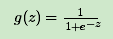
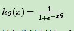
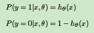
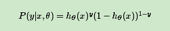
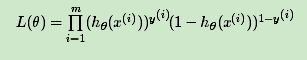
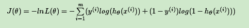
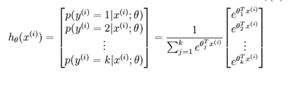
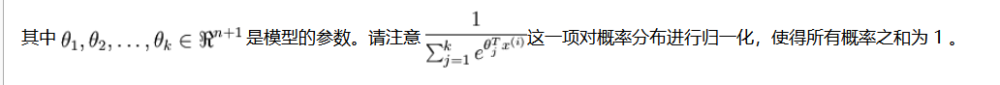
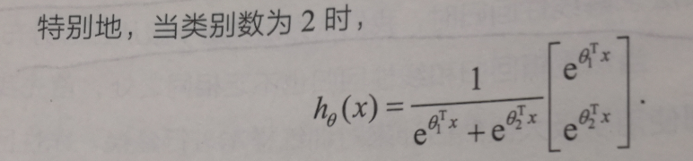
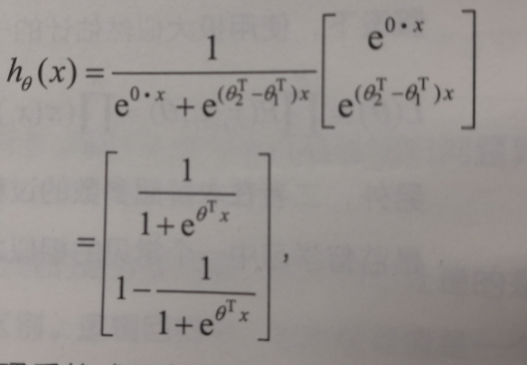

# 逻辑回归
## 二元逻辑回归的模型
对线性回归的结果做一个在函数g上的转换，可以变化为逻辑回归。

如果我们令g(z)中的z为：z=xθ，这样就得到了二元逻辑回归模型的一般形式：

其中x为样本输入，hθ(x)为模型输出，可以理解为某一分类的概率大小。而θ为分类模型的要求出的模型参数。对于模型输出hθ(x)，我们让它和我们的二元样本输出y（假设为0和1）有这样的对应关系，如果hθ(x)>0.5 ，即xθ>0, 则y为1。如果hθ(x)<0.5，即xθ<0, 则y为0。y=0.5是临界情况，此时xθ=0，从逻辑回归模型本身无法确定分类。

## 二元逻辑回归的损失函数

把这两个式子写成一个式子，就是：

这里我们用对数似然函数最大化，对数似然函数取反即为我们的损失函数J(θ)。其中：
似然函数的代数表达式为：

其中m为样本的个数。
对似然函数对数化取反的表达式，即损失函数表达式为：

## 二元逻辑回归的推广：多元逻辑回归
使用softmax

softmax具有参数冗余的特点，即将θ1，θ2，...,θk同时加减一个向量后预测结果不变。

将所有参数减去θ1

其中θ=θ2-θ1
逻辑回归与线性回归最大的区别是，逻辑回归的因变量是离散的，线性回归是连续的。